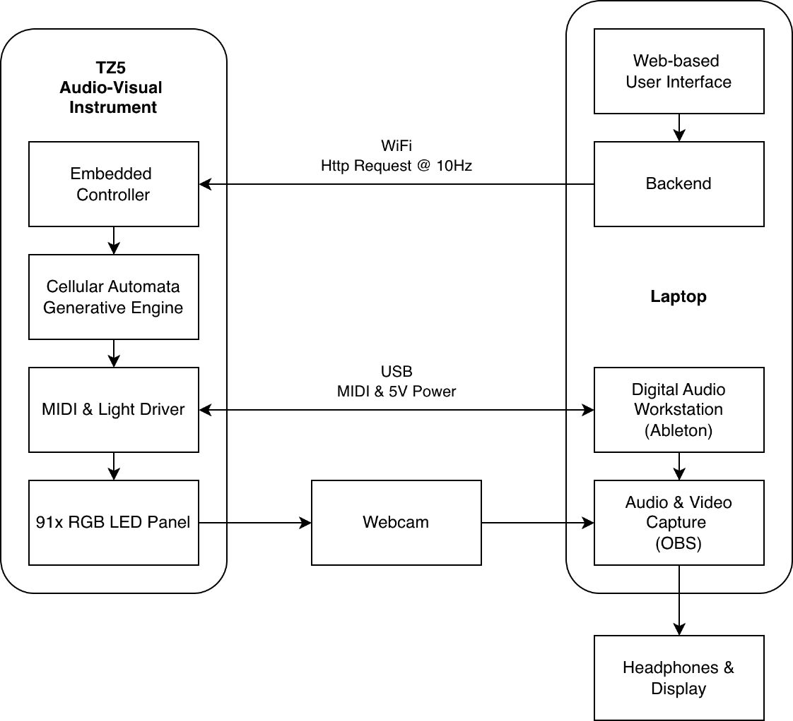
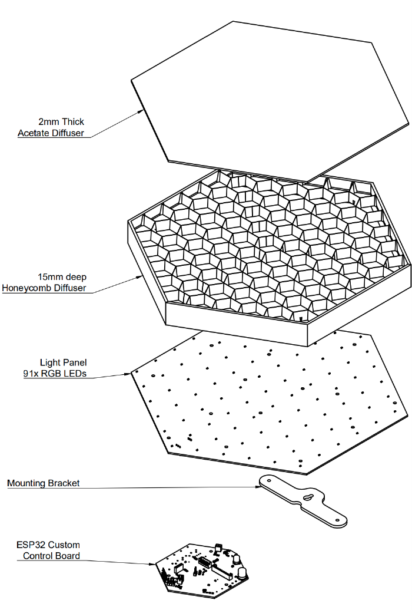
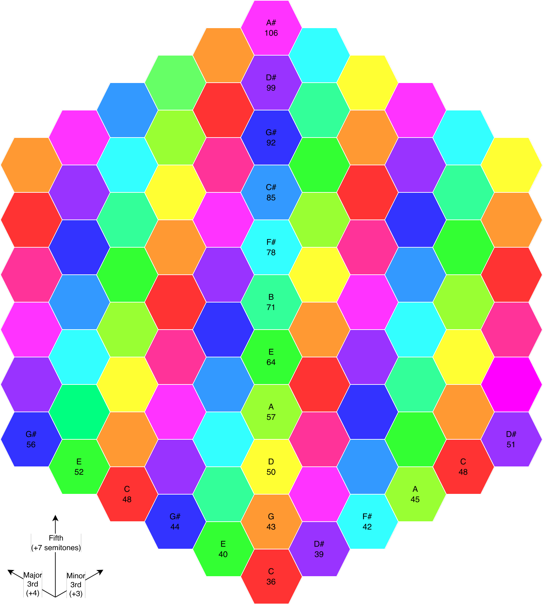
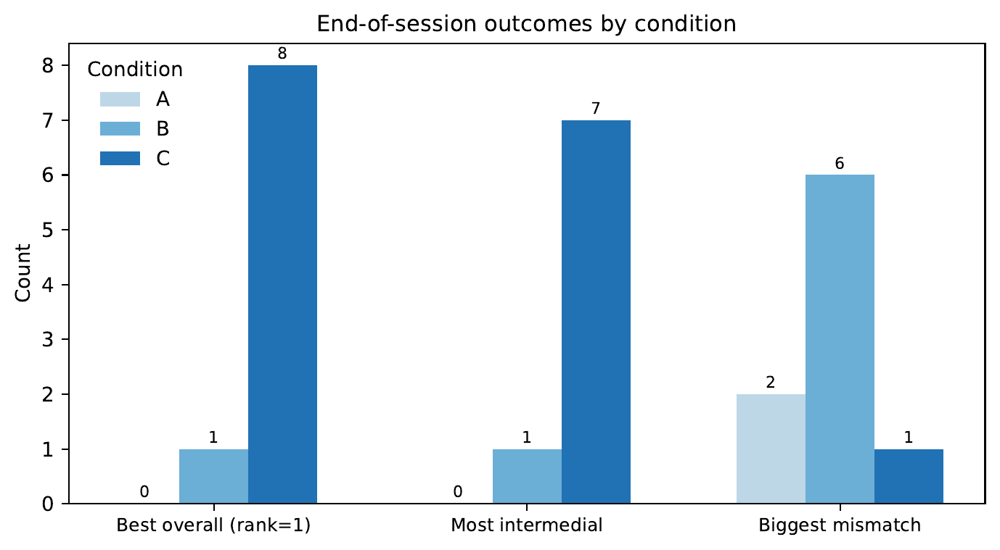
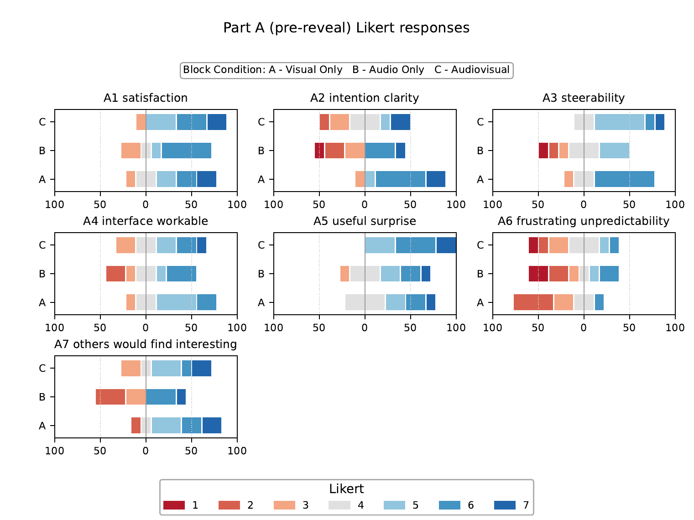
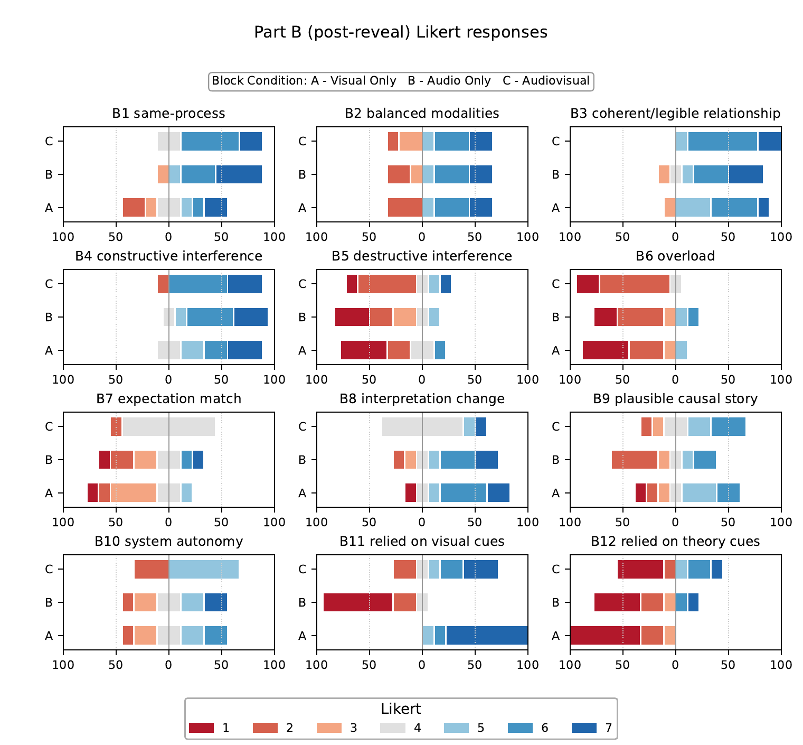
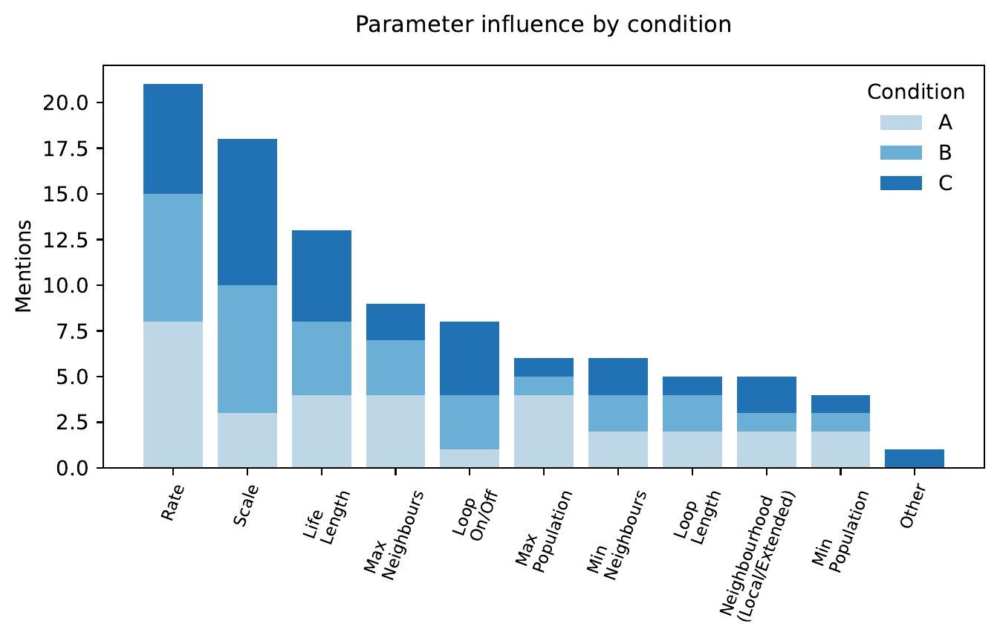
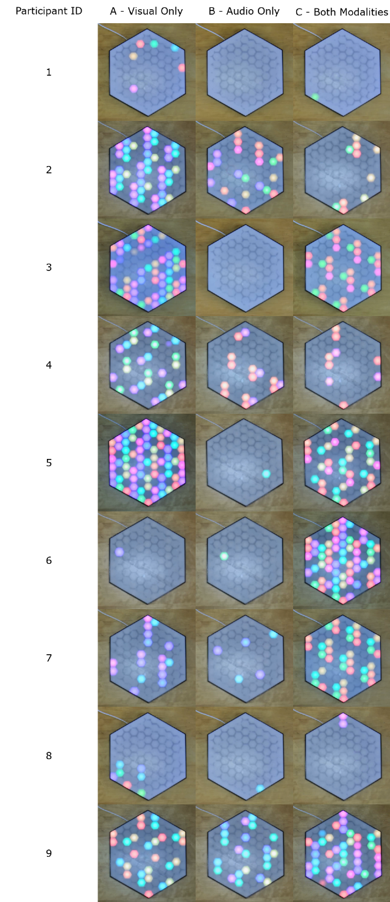

**Abstract**

Coupled audiovisual instruments, in which sound and image are produced
from a shared generative process, promise media equality by design.
But does causal coupling actually deliver perceptual parity? This
article asks how composers experience media equality and intermedial
interference when working with such an instrument.

We report a practice-based study of the Cellular Au-Tonnetz, a system
in which audio and LED light are parallel projections of the same
evolving cellular-automaton state. Nine participants composed short
pieces under three modality conditions: visual-only, audio-only, and
audiovisual. Each was followed by replay with both modalities revealed.
By withholding one medium during composition and reinstating it at
replay, the protocol makes the construction of audiovisual experience
observable.

Audiovisual access was preferred overall (8 of 9 participants), but the
audio-only condition most often produced the largest perceived mismatch
(6 of 9), and replay frequently turned apparent mismatch into coherent
re-reading. Mismatch typically took the form of cue conflict: temporal
persistence, density correspondence, perceptual masking. Productive
interference emerged at replay through rebinding. We position this as
foundational practice-based work, offering a method other practitioners
can adopt, and design priorities for instruments where sound and image
share a single generative substrate.

**1 Introduction**

Electroacoustic audiovisual composition is often discussed through
models that implicitly privilege one medium: sound as structural driver
with image as visualisation, a stance common in visual music practice
(Hyde 2012; Watkins 2018); or image as narrative driver with sound as
enhancement, inherited from film sound (Chion 1994; Cook 1998). Even where
practitioners aim for parity, perceptual salience and the practical
realities of workflow and interface design tend to reintroduce
hierarchy, a tension that Harris (2016) and Hill (2013) have
articulated explicitly. The Organised Sound call for this thematic
issue highlights this as a problem of media equality and raises
intermedial interference as a prompt for reconceptualising how media
relationships are composed and perceived (Organised Sound 2026).
Interference has also been developed as a compositional and analytic
focus within electroacoustic audiovisual practice (Chiaramonte 2024).

The article takes a design-and-evaluation approach. We treat
intermediality as a manipulable design problem that can be evaluated in
practice, focusing on generative instruments in which sound and moving
image are produced in real time from shared processes. In such
instruments, composing means shaping the dynamics of an underlying
generative substrate rather than synchronising independent media layers
after the fact.

The coupling pattern we examine is state-space projection: sound and
image are parallel projections of a single evolving state, rather than
one medium being derived from or aligned to the other. Because the
coupling is causal, with every change in the underlying state changing
both modalities, it provides a concrete basis for evaluating intermedial
interference.

**1.1 Intermedial interference as a design and evaluation problem**

Intermedial interference is used here, following Chiaramonte (2024), to
denote the perceptual and interpretive consequences of interactions
between salient features of the two media. It includes constructive
effects (reinforcement, increased legibility, and meaningful surprise)
and destructive effects (contradiction, masking, overload, and reduced
causal confidence). In a
state-space projection system, interference is design-sensitive: it
emerges from mapping choices, temporal envelopes, constraint regimes,
and the performer's ability to build and test a causal model while
composing.

Despite the prevalence of generative systems in electroacoustic and
audiovisual practices, evaluation is often limited to descriptive
accounts or anecdotal response. This makes it difficult to compare
design choices or to articulate how a system supports or undermines
parity between media. The field needs evaluation approaches that
combine practice-based validity with analysable evidence and that link
participant experience to perceivable properties of captured artefacts.

**1.2 Research questions and contributions**

The study addresses three questions:

**RQ1 (intermedial equality)**: To what extent do participants perceive
sound and light as co-equal contributors to the audiovisual experience
when composing with the system?

**RQ2 (intermedial interference)**: What forms of constructive and
destructive intermedial interference arise in practice, and how do they
relate to modality access and parameter shaping?

**RQ3 (agency and causality)**: How do perceptions of authorship,
predictability, and steerability change when one modality is unavailable
during composition?

The article contributes:

- A state-space projection framing of intermedial composition in which
  sound and light are treated as parallel projections of a shared
  generative substrate, enabling analysis without default media
  hierarchy.

- An evaluation method for practice-based intermedial research,
  combining modality-access manipulation, replay-based reveal, and
  traceable artefact capture, that produces analysable evidence within
  realistic artistic development timelines.

- An interference-focused account of mechanisms (cue conflict and
  rebinding) and instrument-actionable design priorities that improve
  media equality in coupled generative instruments.

**2 Related work**

Intermediality is often used as a general label for work between media,
but its analytic value depends on specifying the intermedial relation at
stake. Rajewsky distinguishes medial transposition, media combination,
and intermedial reference; this paper is concerned with media
combination and, specifically, whether sound and time-based light output
are experienced as co-constitutive rather than hierarchical (Rajewsky
2005).

Elleström's modality model provides a useful scaffold for discussing
equality without treating media as undifferentiated streams. By
distinguishing material, sensorial, spatiotemporal, and semiotic
modalities, the model makes it possible to describe where equality
succeeds or fails: parity may hold in causal origin while collapsing in
sensorial salience or semiotic authority (Elleström 2010).

Audiovisual theory in film and sound studies provides durable concepts
for how sound and image are perceived as an integrated whole. Chion's
account of audio-vision emphasises that audiovisual perception is not
additive; sound and image reciprocally frame one another's meaning. This
is directly relevant to a modality-withholding design: composing with
one modality absent and reinstating it at replay makes the construction
of audio-vision observable, including how expectation, surprise, and
retrospective binding contribute to perceived unity (Chion 1994).

Beyond Chion, several frameworks address the encounter and composition
of electroacoustic audiovisual works directly. Coulter (2010) classifies
sound-image pairs along referential and abstract axes and distinguishes
concomitant from isomorphic relationships, offering a vocabulary for
how shared formal characteristics catalyse audiovisual integration.
Garro (2012) places audiovisual association strategies on a continuum
from separation through intuitive complementarity, synchresis, and
parametric mapping, contrasting Chion's visually-driven cinema contract
with a visual music contract that holds "the primacy of both ear and
eye together" as its artistic credo. Hill (2013) extends this work
towards audience interpretation, where schemata, lived experience, and
contextual framing make audiovisual works legible across diverse
encounters. Harris (2016) takes an explicit anti-hierarchy position,
rejecting the term "visual music" because it implies musicality takes
precedence and arguing instead for sound and image as parts of a single
coherent system. From within the visual music tradition itself, Hyde
(2012) develops the concepts of visual silence, visual noise, and
visual suspension as ocular counterparts to musique concrète, and
Watkins (2018) treats audio-visual rhythm as a compositional concern.

Within electroacoustic and intermedial discourse, intermedial
interference foregrounds constructive and destructive interactions
between media features and provides a handle for theorising media
equality beyond simple synchrony (Organised Sound 2026; Chiaramonte
2024). Remediation and multimedia analysis further motivate treating
media relations as constitutive rather than additive, and provide
vocabulary for how one medium can frame or re-situate another (Bolter
and Grusin 1999; Cook 1998).

For coupled generative instruments, crossmodal correspondences offer a
complementary design lens. Spence synthesises evidence that people
reliably associate features across modalities (for example, pitch and
brightness), making correspondences a resource for designing legible
mappings (Spence 2011). In the present system, correspondence helps
explain why some participants use colour similarity as a proxy for
harmonic planning even without formal theory.

Evaluation traditions in digital musical instruments provide precedents
for studying agency negotiation without reducing outcomes to usability.
O'Modhrain proposes a framework supporting structured reflection on
experience while remaining sensitive to musical context (O'Modhrain
2011). Orio and Wanderley similarly discuss method rationales for
evaluating input devices for musical expression that bridge performer
experience and system iteration (Orio and Wanderley 2002).

Finally, the specific substrates used here have well-established
lineages. Tonnetz representations are canonical in neo-Riemannian and
transformational theory, where neighbourhood relations correspond to
parsimonious voice-leading operations (Cohn 1997; Douthett and Steinbach
1998). Cellular automata also have a long-standing lineage as musical
generative formalisms valued for emergent structure from simple local
rules (Miranda 2007). Besada et al. highlight cognitive and HCI challenges in
Tonnetz-at-first-sight interaction, where visible patterns in the
lattice geometry, such as the triangular groupings that form familiar
chord shapes, can bias harmonic expectation; here, such bias
is treated not only as a usability risk but as a potential resource for
productive intermedial interference in a coupled audio and light system
(Besada et al. 2024).

**3 Method**

**3.1 Participants and ethics**

Nine participants completed the solo protocol (N = 9), recruited via
convenience sampling across a range of musical experience and
familiarity with generative systems. Participants provided informed
consent for audio and video capture and for anonymised excerpts to be
used as research stimuli. Background questions captured self-reported
musical experience, theory familiarity, familiarity with generative
systems, Tonnetz familiarity, and any relevant perceptual notes (for
example, colour-vision deficiency and sensitivity to flashing lights).

**3.2 System under study**

The study evaluates the Cellular Au-Tonnetz (TZ5), previously described
as a unified audiovisual MIDI generator that couples Tonnetz
pitch-space mapping with cellular automata and a web-configured embedded
control architecture (Didiot-Cook 2025).

The system's core design feature is shared causal origin. A
Tonnetz-mapped lattice of pitch classes evolves via asynchronous
cellular automata dynamics under local rule thresholds and global
population constraints. The same evolving state is rendered as (i)
MIDI-driven audio output and (ii) LED-panel activity using a fixed
pitch-class-to-colour mapping. In this framing, sound and light are
parallel projections of a shared latent score: a single evolving
substrate that is perceived through two modalities.

{#fig:fig1 width=100%}

{#fig:fig2 width=100%}

{#fig:fig3 width=100%}

**3.3 Participant-facing control parameters**

Participants steered the system exclusively via a browser-based user
interface. The parameter set was intentionally compact and targeted
density, temporal dynamics, neighbourhood constraints, recurrence, and
harmonic admissibility:

- **Density bounds**: Min Population and Max Population.
- **Temporal dynamics**: Rate (update interval) and Life Length
  (activation lifetime).
- **Neighbourhood constraints**: Neighbourhood extent (6 local
  neighbours or 18 extended), Min Neighbours, and Max Neighbours.
- **Recurrence**: Loop On or Off and Loop Length.
- **Harmonic admissibility**: Scale (constrains pitch classes and
  therefore the visible palette).

**3.4 Study design**

The solo study used a within-subject design with three modality-access
blocks per participant:

**A**: visual-only composition (panel visible; audio masked)

**B**: audio-only composition (audio available; panel occluded)

**C**: audiovisual composition (both modalities available)

In all blocks, both audio and video were recorded and the end-state
parameter preset was saved for traceability and repeatability. Block
order was counterbalanced across participants.

**3.5 Procedure and measures**

Each block began from a shared starting preset (S0) and lasted
approximately 5 minutes. Participants were instructed to create
something interesting, and to record a final excerpt (60 to 120 seconds)
with parameter changes permitted during recording. Immediately after
each capture, the excerpt was replayed with both modalities enabled (the
reveal), followed by a two-part questionnaire:

**Part A (pre-reveal)**: ratings and brief notes about the composition
experience under constraint.

**Part B (post-reveal)**: ratings and reflections about the fused
audiovisual result after replay.

Likert items used a 7-point scale (1 = strongly disagree, 7 = strongly
agree). Part A captured satisfaction (A1), intention clarity (A2),
steerability (A3), interface understandability (A4), useful surprise
(A5), frustrating unpredictability (A6), and confidence others would
find the result interesting (A7). Part B captured same-process judgement
(B1), modality balance (B2), coherence (B3), constructive reinforcement
(B4), destructive contradiction (B5), overload (B6), expectation match
(B7), interpretation change (B8), causal story plausibility (B9),
perceived autonomy (B10), reliance on visual cues (B11), and reliance on
theory cues (B12). After each block, participants nominated up to three
parameters they perceived as most influential.

At session end, participants ranked their three outputs, selected the
condition that felt most intermedial, selected the condition with the
biggest mismatch, and described one change that would improve media
equality or intermedial legibility.

Where participant quotations appear in this article, minor spelling and
typing errors have been silently corrected for readability; meaning and
structure are unchanged.

**4 Results**

**4.1 Data completeness**

All nine participants completed all three blocks (27 of 27 blocks).
Saved presets provide a direct link from questionnaire responses to
reproducible system states.

**4.2 Condition preference, perceived intermediality, and mismatch**

End-of-session rankings show a strong preference for audiovisual access:
8 of 9 participants ranked condition C as best overall; 1 of 9 ranked
condition B best overall. Participants most frequently selected
condition C as most intermedial (7 of 9), with one selecting B and one
indicating uncertainty.

Mismatch reports concentrated in the audio-only condition: 6 of 9
participants nominated B as the biggest mismatch, compared with A (2 of
9) and C (1 of 9).

{#fig:fig4 width=100%}

**4.3 Strategies under constraint**

Participants described compositional approaches that clustered into
strategy families: density shaping, arcs or narrative forms, loop-based
structuring, scale or harmony selection, and rapid A/B testing of
parameters to learn local cause-effect relations.

**Visual-only composition** often supported a stable action-evaluation
loop. Figure 5 shows A2 (intention clarity) and A3 (steerability)
clustering towards agreement in condition A relative to condition B,
consistent with state visibility supporting intention formation and
monitoring. For example, one participant aimed to fill the grid and
shape form over time: "Fill the whole grid with lights.
Build up a full grid then switch the rate up and down" (Participant 3,
visual-only block, pre-reveal). Another described a similar
density-first approach: "Start with lots of colour covering
the grid, then reduce intensity and bring it back up to full coverage"
(Participant 1, visual-only block, pre-reveal).

{#fig:fig5 width=100%}

Visual-only access was sometimes described as creatively liberating,
especially for trained musicians. Participant 8 reported that removing
audio reduced theory-led self-monitoring and enabled a more playful mode
of exploration: "didn't even think about pitch and what scale notes to
use on the visual block... satisfaction is interesting as I felt in a
playful state so satisfaction higher than if I was in a performance
/product state" (Participant 8, visual-only block, post-reveal).

**Audio-only composition** shifted strategies towards pacing, texture,
and repetition as a stabiliser. Figure 5 shows A2, A3, and A4 (interface
understandability) more mixed in condition B, consistent with the loss
of visible state during action. Participants responded by creating
musical containers through recurrence: "Looping was
fundamental... starting with basic, empty loop... keeping it sparse...
and then come back to another loop" (Participant 8, audio-only block,
pre-reveal). Others described exploratory testing: "More
A/B testing to understand the properties" (Participant 3, audio-only
block, pre-reveal).

**Audiovisual composition** commonly integrated lessons learned from
constrained runs. Figure 5 shows high satisfaction (A1) and high useful
surprise (A5) in condition C, alongside qualitative accounts of
combining purposeful shaping with exploratory play. One participant also
noted a practical attentional tension: "had to remind
myself to keep looking at the visuals... more of an affinity with sound"
(Participant 8, audiovisual block, pre-reveal).

**4.4 The reveal as a site of rebinding and reinterpretation**

A recurring theme was the reveal acting as a moment of retrospective
binding. Figure 6 shows that B1 (same-process judgement) and B4
(constructive reinforcement) are strongest after audio-only and
audiovisual composition, while B8 (interpretation change) increases most
when one modality has been withheld, consistent with replay functioning
as calibration.

{#fig:fig6 width=100%}

Qualitative accounts support this. One participant described audio-only
replay as exceeding expectations: "The outcome was more
satisfying than I felt the recording and playing process went... on
review had more structure than maybe I realised during the process of
recording" (Participant 3, audio-only block, post-reveal). Another
described a strong positive mismatch on reveal: "I had no expectation
of what the visuals should be, but when I saw it, it was so beautiful"
(Participant 8, audio-only block, post-reveal).

**4.5 Attentional hierarchy and media equality as negotiated practice**

Participants repeatedly described media equality as something they had
to achieve, rather than something guaranteed by coupling. Several
accounts describe sound as perceptually dominant and therefore hard to
ignore: "For me, the audio had to be removed completely
before I could prioritise the visual. The audio was more important to my
overall experience" (Participant 2, end-of-session reflection). Others
described the inverse: "The visual patterns help reveal the
relationships between notes" (Participant 3, audio-only block,
post-reveal).

These experiences align with cue reliance patterns. Figure 6 indicates
that reliance on visual cues (B11) remains substantial even when the
visual channel was absent during composition, suggesting that the reveal
can re-weight the causal model towards visual structure when it becomes
available.

**4.6 Intermedial interference mechanisms as cue conflict**

When interference was described as disruptive, it was typically framed
as cue conflict where one modality implied temporal, structural, or
causal relations that the other did not support.

**Duration persistence**: "Length of light activity was
misleading for tone length which was shorter and did not match"
(Participant 4, visual-only block, post-reveal). This weakens temporal
correspondence and predictive power.

**Density correspondence**: "A number of sparse visuals
sounded as busy as a previously very active visual" (Participant 9,
visual-only block, post-reveal). This undermines causal confidence in
cross-modal heuristics.

**Perceptual masking and auditability**: "Different octaves
of the same note starting at the same time sounded as one" (Participant
9, visual-only block, post-reveal). When events are not audibly
separable, cross-modal checking is weakened.

Participants also reported productive interference when cues reinforced,
reflected in Figure 6 by strong endorsement of B4 (constructive
reinforcement) and comparatively lower endorsement of B5 (destructive
contradiction) in the audiovisual condition.

**4.7 Agency and co-creative negotiation**

Across conditions, participants framed interaction less as direct
control and more as negotiated agency. Some described collaboration with
the instrument: "there's something like a collaboration
working with the instrument" (Participant 8, audiovisual block,
pre-reveal). Others framed the experience as discovering structure
beyond their own intention: "The reviewed videos were more
satisfying than I might have imagined... having played a part in
constructing the light and sound felt like I had some agency and ability
to control a somewhat autonomous system" (Participant 3, end-of-session
reflection).

These accounts align with Figure 5 where A5 (useful surprise) remains
high across conditions, while A6 (frustrating unpredictability) is not
uniformly dominant, indicating that emergence was often valued when it
remained steerable.

**4.8 Parameter strategy and perceived leverage**

Across conditions, participants identified a stable core of influential
controls and a modality-dependent shift. Rate was consistently nominated
as influential, aligning with qualitative descriptions of shaping
overall dynamism and arc structure. Scale was nominated more frequently
when sound was available, consistent with participants treating harmonic
admissibility as a primary steering dimension when auditory feedback is
present.

{#fig:fig7 width=100%}

**4.9 Participant-led design requirements**

Participant change requests converge on cue reliability and constraint
transparency:

- **Align temporal cues**: "Incorporate ADSR envelopes into the audio
  and visuals" (Participant 1, end-of-session reflection).
- **Improve mapping legibility**: "Seeing the colours of the notes,
  regardless of them being played may have helped build more harmonious
  sounds" (Participant 3, end-of-session reflection).
- **Reduce overload and support attention management**: "just having
  high activity/dynamics of light and sound would be overwhelming and
  not satisfying" (Participant 4, end-of-session reflection).
- **Improve interface ergonomics**: "Put the interface on one page
  without scrolling" (Participant 9, end-of-session reflection).

These requirements map directly onto the interference mechanisms above:
where cue structure was reliable, participants reported reinforcement;
where cues conflicted or masked one another, participants reported
mismatch and reduced steerability.

{#fig:fig8 width=100%}

**5 Discussion**

**5.1 Media equality is not guaranteed by coupling**

The Cellular Au-Tonnetz represents sound and light as parallel
projections of a shared evolving state. However, participant reports
show that causal parity does not automatically yield perceptual or
interpretive parity. Equality emerged as negotiated practice shaped by
attentional dominance, cue reliability, and participants' evolving
causal models. The strong preference for audiovisual access indicates
that simultaneous access most often supports the full
intention-monitoring-interpretation loop: participants can form
intentions with reference to both media, test hypotheses during
interaction, and refine causal inference in real time.

Modality constraint, applied within a coupled system, can be beneficial
rather than only degradative. One trained musician described visual-only
composition as creatively liberating because it suspended real-time
harmonic self-monitoring and invited a more exploratory stance.
Temporarily relinquishing one modality can reduce evaluative pressure
and open alternative compositional strategies, which in turn may support
later intermedial rebinding at reveal. This suggests a design
opportunity: intermedial instruments may benefit from explicit
"constraint modes" that intentionally reweight attention and agency,
allowing users to move between exploratory play and audiovisually
accountable refinement rather than treating constraint purely as an
experimental manipulation.

**5.2 Interference as cue conflict and productive discontinuity**

The results support an interference account centred on cue structure:

- Temporal cue conflict (persistence versus articulation)

- Density cue conflict (visual occupation versus auditory busyness)

- Auditability limits (masking and indistinguishable events)

- Salience dominance (one modality monopolises attention)

- Rebinding (post-reveal reinterpretation that revalues mismatch)

Mismatch was not uniformly negative. Post-reveal replay often revalued
apparent mismatch as coherent structure, indicating that interference
valence depends on whether divergence produces interpretive dead ends
(loss of legibility) or rewarded rebinding (expanded causal model). For
practice-based research, this supports treating the reveal as a
deliberate compositional and evaluative mechanism.

**5.3 Design implications for state-space projection instruments**

Because interference manifested as cue reliability problems, design
improvements can be framed as interventions on cue structure rather than
superficial polish:

- Align temporal envelopes across modalities (for example, link light
  decay to note release).

- Increase auditory event discriminability (articulation, voicing,
  timbral differentiation) to reduce masking.

- Strengthen mapping legibility (colour fidelity, persistent reference
  cues, and clearly communicated constraints).

- Make constraint regimes transparent (loop semantics, reset
  affordances, and parameter scaling that matches perceptual intuition).

These priorities generalise beyond this case study because they target
how performers construct and test causal models while composing.

**5.4 Limits and scope**

With nine participants, a single synthesis configuration, and a
constrained parameter set, the study supports analytic rather than
statistical generalisation. We do not claim population-level effects;
the contribution is foundational. The article shows that media equality
and intermedial interference can be operationalised within realistic
artistic development timelines using modality manipulation, replay-based
reflection, and traceable artefact capture, and the resulting method is
ready to scale. Future work can extend it to other coupled instruments,
longer-form composition, and independent-observer evaluation, with
sample sizes that license stronger inferential claims.

**6 Conclusion**

This article operationalised media equality and intermedial interference
in a practice-based evaluation of the Cellular Au-Tonnetz, a coupled
generative instrument in which sound and LED activity are parallel
projections of a shared evolving state. Audiovisual access was
most often ranked best overall and most intermedial, while audio-only
access most often produced the biggest mismatch.

Across conditions, interference was experienced as both constructive and
destructive. Destructive effects were commonly described as cue
conflicts (temporal persistence, density correspondence, and perceptual
masking), while constructive effects emerged when shared causal origin
supported reinforcement and when post-reveal replay enabled rebinding
and increased perceived coherence. A central implication is that causal
coupling alone does not guarantee perceptual parity: co-equal media
relations depend on cue reliability and interaction design that supports
evolving causal understanding.

More broadly, the study shows how media equality and intermedial
interference can be evaluated through structured practice rather than
through descriptive accounts alone. By linking structured reflection to
reproducible artefacts (saved presets and recorded outputs), the method
supports issue-driven analysis of how media relationships are composed
and perceived in coupled generative systems. As foundational
practice-based work, it establishes a method that larger-scale
follow-ups can refine and extend across other coupled instruments and
longer-form composition.

**Supplementary Materials**

All 32 videos, parameter dataset, and survey results, can be found here:

[https://github.com/td0034/OrganisedSound/](https://github.com/td0034/OrganisedSound/)

**Acknowledgements**

I thank the participants who gave their time to this study, Simon Jones
and Sabine Hauert for encouragement to conduct the evaluation, and Rosa
Beesley for ongoing support.

The author used ChatGPT (OpenAI) to assist with drafting, language
editing, proofing, survey web development, and Python scripting for
results analysis. All outputs were reviewed and edited by the author,
who takes full responsibility for the final manuscript and materials.

**References**

Besada, J. L., Bisesi, E., Guichaoua, C. and Andreatta, M. 2024. The
Tonnetz at First Sight: Cognitive Issues of Human-Computer Interaction
with Pitch Spaces. *Music and Science* 7: 20592043241246515.
[https://doi.org/10.1177/20592043241246515](https://doi.org/10.1177/20592043241246515).

Bolter, J. D. and Grusin, R. 1999. *Remediation: Understanding New
Media*. Cambridge, MA: MIT Press.

Chiaramonte, A. 2024. *Intermedial Interference in Electroacoustic
Audiovisual Composition: An Investigation into Combining, Integrating,
and Fusing Sound and the Moving Image. A Portfolio of Audiovisual
Compositions*. PhD thesis. Bournemouth University.
[https://eprints.bournemouth.ac.uk/40772/](https://eprints.bournemouth.ac.uk/40772/).

Chion, M. 1994. *Audio-Vision: Sound on Screen*. New York: Columbia
University Press.

Cohn, R. 1997. Neo-Riemannian Operations, Parsimonious Trichords, and
Their Tonnetz Representations. *Journal of Music Theory* 41(1): 1-66.

Cook, N. 1998. *Analysing Musical Multimedia*. Oxford: Clarendon Press.

Coulter, J. 2010. Electroacoustic Music with Moving Images: the art of
media pairing. *Organised Sound* 15(1): 26-34.
[https://doi.org/10.1017/S1355771809990239](https://doi.org/10.1017/S1355771809990239).

Didiot-Cook, T. 2025. Cellular Au-Tonnetz: A Unified Audio-Visual MIDI
Generator Using Tonnetz, Cellular Automata, and IoT. In P. Machado, C.
Johnson and I. Santos (eds.) *Artificial Intelligence in Music, Sound,
Art and Design. EvoMUSART 2025*. Lecture Notes in Computer Science
15611. Cham: Springer, 51-65.
[https://doi.org/10.1007/978-3-031-90167-6_4](https://doi.org/10.1007/978-3-031-90167-6_4).

Douthett, J. and Steinbach, P. 1998. Parsimonious Graphs: A Study in
Parsimony, Contextual Transformations, and Modes of Limited
Transposition. *Journal of Music Theory* 42(2): 241-263.

Elleström, L. 2010. The Modalities of Media: A Model for Understanding
Intermedial Relations. In L. Elleström (ed.) *Media Borders,
Multimodality and Intermediality*. London: Palgrave Macmillan, 11-48.
[https://doi.org/10.1057/9780230275201_2](https://doi.org/10.1057/9780230275201_2).

Garro, D. 2012. From Sonic Art to Visual Music: Divergences,
convergences, intersections. *Organised Sound* 17(2): 103-113.
[https://doi.org/10.1017/S1355771812000027](https://doi.org/10.1017/S1355771812000027).

Harris, L. 2016. Audiovisual Coherence and Physical Presence: I am
there, therefore I am [?]. *eContact!* 18(2).
[https://econtact.ca/18_2/harris_audiovisualcoherence.html](https://econtact.ca/18_2/harris_audiovisualcoherence.html).

Hill, A. 2013. *Interpreting Electroacoustic Audio-visual Music*. PhD
thesis. De Montfort University.
[https://hdl.handle.net/2086/9898](https://hdl.handle.net/2086/9898).

Hyde, J. 2012. Musique Concrète Thinking in Visual Music Practice:
Audiovisual silence and noise, reduced listening and visual suspension.
*Organised Sound* 17(2): 170-178.
[https://doi.org/10.1017/S1355771812000106](https://doi.org/10.1017/S1355771812000106).

Miranda, E. R. 2007. Cellular Automata Music: From Sound Synthesis to
Musical Forms. In E. R. Miranda (ed.) *Evolutionary Computer Music*.
London: Springer, 170-193.
[https://doi.org/10.1007/978-1-84628-600-1_8](https://doi.org/10.1007/978-1-84628-600-1_8).

O'Modhrain, S. 2011. A framework for the evaluation of digital musical
instruments. *Computer Music Journal* 35(1): 28-42.
[https://doi.org/10.1162/COMJ_a_00038](https://doi.org/10.1162/COMJ_a_00038).

Organised Sound. 2026. Call: Electroacoustic Audiovisual Composition and
Intermediality: Reconceptualising media relationships. 15 January.
Cambridge University Press.
[www.cambridge.org/core/journals/organised-sound/announcements/call-for-papers/call-electroacoustic-audiovisual-composition-and-intermediality-reconceptualising-media-relationships](http://www.cambridge.org/core/journals/organised-sound/announcements/call-for-papers/call-electroacoustic-audiovisual-composition-and-intermediality-reconceptualising-media-relationships)
(accessed 5 January 2026).

Orio, N. and Wanderley, M. M. 2002. Evaluation of input devices for
musical expression: borrowing tools from HCI. *Computer Music Journal*
26(3): 62-76.
[https://doi.org/10.1162/014892602320582981](https://doi.org/10.1162/014892602320582981).

Rajewsky, I. O. 2005. Intermediality, Intertextuality, and Remediation:
A Literary Perspective on Intermediality. *Intermédialités* 6: 43-64.
[https://doi.org/10.7202/1005505ar](https://doi.org/10.7202/1005505ar).

Spence, C. 2011. Crossmodal correspondences: A tutorial review.
*Attention, Perception, and Psychophysics* 73: 971-995.
[https://doi.org/10.3758/s13414-010-0073-7](https://doi.org/10.3758/s13414-010-0073-7).

Watkins, J. 2018. Composing Visual Music: Visual Music Practice at the
Intersection of Technology, Audio-visual Rhythms and Human Traces.
*Body, Space & Technology* 17(1): 51-75.
[https://doi.org/10.16995/bst.296](https://doi.org/10.16995/bst.296).
